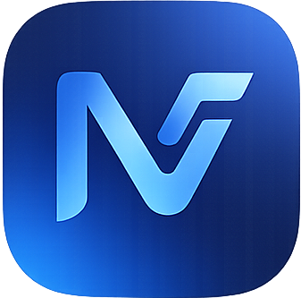

# NeonFlow ⚡

<div align="center">
  
  
  **Advanced Productivity App with Futuristic Design**
  
  [](https://github.com/TsioryRasoloarijaona/neonFlow)
  [](LICENSE)
  [](https://www.electronjs.org/)
  [](https://reactjs.org/)
</div>

---

## 📋 Table of Contents

- [Features](#-features)
- [Installation](#-installation)
- [Tech Stack](#-tech-stack)

---

## ✨ Features

### 🏠 **Dashboard**
- **Overview Statistics**: View at-a-glance metrics for your tasks (To Do, In Progress, Completed)
- **Focus Time Tracking**: Monitor your daily focus sessions
- **Recent Activity**: Track your latest pomodoro sessions and breaks
- **Visual Charts**: Beautiful charts showing task distribution and productivity trends

### ✅ **Task Management**
- **Multiple Views**: Switch between List, Kanban, and Calendar views
- **Task Organization**: Create, edit, and delete tasks with ease
- **Status Tracking**: Organize tasks by status (To Do, In Progress, Completed)
- **Priority Levels**: Set priorities (Low, Medium, High, Urgent)
- **Due Dates**: Assign deadlines to stay on track
- **Search & Filter**: Quickly find tasks with powerful search functionality
- **Task Highlighting**: Navigate directly to specific tasks from search

### 🎯 **Focus Timer (Pomodoro)**
- **Pomodoro Technique**: 25-minute focus sessions with 5-minute breaks
- **Session Types**: Work sessions, short breaks, and long breaks
- **Task Integration**: Link focus sessions to specific tasks
- **Session History**: Track all your completed focus sessions
- **Auto-start**: Launch timer directly from command palette

### 📝 **Notes**
- **Rich Text Editor**: Write and format notes with markdown support
- **Quick Search**: Find notes instantly by title
- **Auto-save**: Never lose your work
- **Note Selection**: Click on search results to open notes automatically

### 🔥 **Habits Tracking**
- **Habit Creation**: Build positive habits with custom frequencies
- **Frequency Options**: Daily, Weekly, or Monthly tracking
- **Visual Calendar**: See your progress at a glance
- **Streak Counter**: Track consecutive days/weeks/months
- **Log History**: Mark habits as completed with visual feedback
- **Color-coded Icons**: Beautiful icons with contextual colors

### ⚡ **Automations** *(Coming Soon)*
- Create custom workflows to automate repetitive tasks

### 🔍 **Universal Search (⌘K / Ctrl+K)**
- **Cross-database Search**: Search across tasks, notes, and habits simultaneously
- **Type Indicators**: Visual badges showing content type (Task, Note, Habit)
- **Quick Actions**: Access common actions instantly
- **Smart Navigation**: Jump directly to searched items with highlighting

### 🎨 **Modern UI/UX**
- **Dark/Light Mode**: Seamless theme switching
- **Futuristic Design**: Neon-inspired color scheme
- **Smooth Animations**: Framer Motion-powered transitions
- **Responsive Layout**: Optimized for desktop use
- **Clean Interface**: Minimalist sidebar navigation

---

## 💻 Installation

### **Download Pre-built Binaries**

Download the appropriate version for your operating system:

#### Linux

| File | Description | Download |
|------|-------------|----------|
| `NeonFlow-1.0.0.AppImage` | AppImage (Recommended - works on most distributions) | [Download](https://github.com/TsioryRasoloarijaona/neonFlow/raw/main/apps/NeonFlow-1.0.0.AppImage) |
| `neonflow_1.0.0_amd64.deb` | Debian/Ubuntu package | [Download](https://github.com/TsioryRasoloarijaona/neonFlow/raw/main/apps/neonflow_1.0.0_amd64.deb) |

**Installation Instructions:**
```bash
# AppImage
chmod +x NeonFlow-1.0.0.AppImage
./NeonFlow-1.0.0.AppImage

# Debian/Ubuntu (.deb)
sudo dpkg -i neonflow_1.0.0_amd64.deb
```

#### Windows

| File | Description | Download |
|------|-------------|----------|
| `NeonFlow Setup 1.0.0.exe` | Installer (Recommended) | [Download](https://github.com/TsioryRasoloarijaona/neonFlow/raw/main/apps/NeonFlow%20Setup%201.0.0.exe) |
| `NeonFlow 1.0.0.exe` | Portable (No installation required) | [Download](https://github.com/TsioryRasoloarijaona/neonFlow/raw/main/apps/NeonFlow%201.0.0.exe) |

**Installation Instructions:**
```bash
# Installer - Double-click to install
NeonFlow Setup 1.0.0.exe

# Portable - Run directly without installation
NeonFlow 1.0.0.exe
```

## 📖 User Manual

### **Getting Started**

1. **Launch NeonFlow**: Open the application
2. **Explore Dashboard**: View your productivity overview
3. **Create Your First Task**: Navigate to Tasks → Click "New Task"
4. **Start a Focus Session**: Go to Focus → Select a task → Click "Start Pomodoro"

### **Managing Tasks**

#### Creating a Task
1. Click **Tasks** in the sidebar
2. Click the **"+ New Task"** button
3. Fill in task details:
   - **Title**: Task name
   - **Description**: Additional details
   - **Status**: To Do / In Progress / Completed
   - **Priority**: Low / Medium / High / Urgent
   - **Due Date**: Set a deadline
4. Click **"Create Task"**

#### Switching Views
- **List View**: Traditional task list
- **Kanban View**: Visual board with columns (To Do, In Progress, Completed)
- **Calendar View**: See tasks organized by due date

#### Editing/Deleting Tasks
- Click the **Edit** icon to modify a task
- Click the **Delete** icon to remove a task

### **Using the Focus Timer**

1. Navigate to **Focus** page
2. Select a task to link (optional)
3. Click **"Start Pomodoro"**
4. Work for 25 minutes
5. Take a 5-minute break
6. Repeat 4 times, then take a longer break

**Timer Controls:**
- **Pause**: Temporarily stop the timer
- **Resume**: Continue from where you paused
- **Reset**: Start over

### **Creating Notes**

1. Click **Notes** in the sidebar
2. Click **"+ New Note"**
3. Enter a title
4. Write your content in the editor
5. Notes auto-save as you type
6. Use the search bar to find notes quickly

### **Tracking Habits**

1. Go to **Habits** page
2. Click **"+ New Habit"**
3. Enter habit details:
   - **Name**: Habit description
   - **Frequency**: Daily / Weekly / Monthly
4. Click **"Create Habit"**
5. Mark habits as complete by clicking the checkmark icon
6. View your streak and calendar progress

### **Universal Search**

Press **⌘K** (Mac) or **Ctrl+K** (Windows/Linux) to open the command palette:

- Type to search across all your data
- See results from Tasks, Notes, and Habits
- Click any result to navigate directly to it
- Use quick actions:
  - **New Task**: Create a task instantly
  - **Start Focus**: Begin a pomodoro session
  - **Search Tasks**: Jump to tasks page

---

## ⌨️ Keyboard Shortcuts

| Shortcut | Action |
|----------|--------|
| `⌘K` / `Ctrl+K` | Open Command Palette |
| `Esc` | Close Command Palette |
| `↑` / `↓` | Navigate search results |
| `Enter` | Select highlighted item |


## 🔧 Tech Stack

### **Frontend**
- **React 18.2** - UI framework
- **TypeScript** - Type safety
- **Tailwind CSS** - Styling
- **Framer Motion** - Animations
- **Lucide React** - Icon library
- **Zustand** - State management

### **Backend**
- **Electron 29.1** - Desktop framework
- **Better-SQLite3** - Database
- **Node.js** - Runtime environment

### **Build Tools**
- **Vite** - Build tool and dev server
- **Electron Builder** - Packaging and distribution
- **TypeScript Compiler** - Type checking

### **Additional Libraries**
- **@hello-pangea/dnd** - Drag and drop
- **date-fns** - Date manipulation
- **marked** - Markdown parsing
- **cmdk** - Command palette
- **recharts** - Data visualization

---

## 📊 Database

NeonFlow uses **SQLite** for local data storage. The database is located at:

- **Linux**: `~/.config/neonflow/neonflow.db`
- **Windows**: `%APPDATA%/neonflow/neonflow.db`
- **macOS**: `~/Library/Application Support/neonflow/neonflow.db`

Your data is stored locally and never leaves your device.

---

## 🤝 Contributing

Contributions are welcome! Please feel free to submit a Pull Request.

1. Fork the repository
2. Create your feature branch (`git checkout -b feature/AmazingFeature`)
3. Commit your changes (`git commit -m 'Add some AmazingFeature'`)
4. Push to the branch (`git push origin feature/AmazingFeature`)
5. Open a Pull Request

---

## 📝 License

This project is licensed under the MIT License - see the [LICENSE](LICENSE) file for details.

---

## 👤 Author

**Tsiory Rasoloarijaona**
- Email: hei.tsiory@gmail.com
- GitHub: [@TsioryRasoloarijaona](https://github.com/TsioryRasoloarijaona)

---

## 🙏 Acknowledgments

- Inspired by modern productivity tools
- Built with ❤️ using open-source technologies
- Special thanks to the Electron and React communities

---

<div align="center">
  Made with ⚡ by Tsiory Rasoloarijaona
</div>
